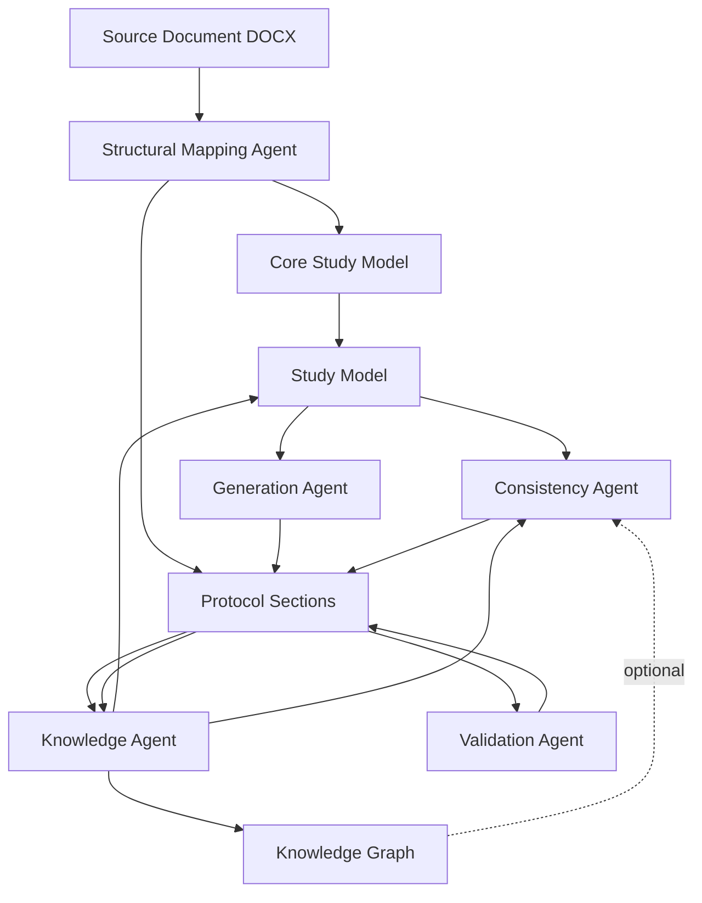
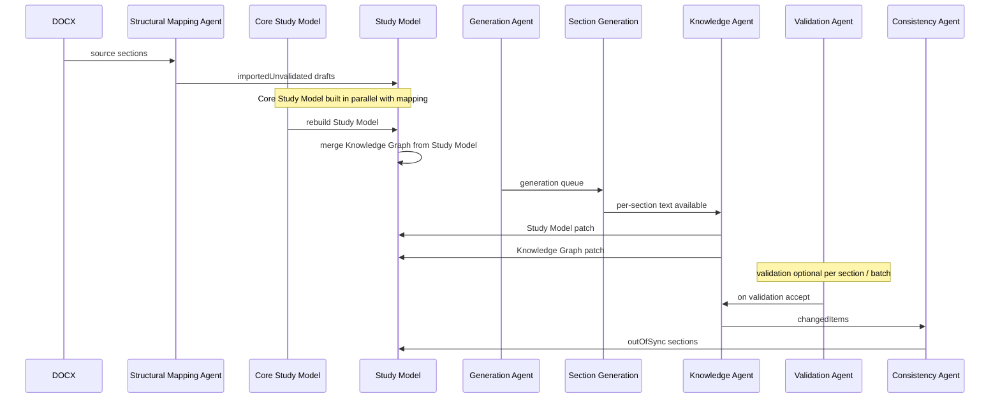
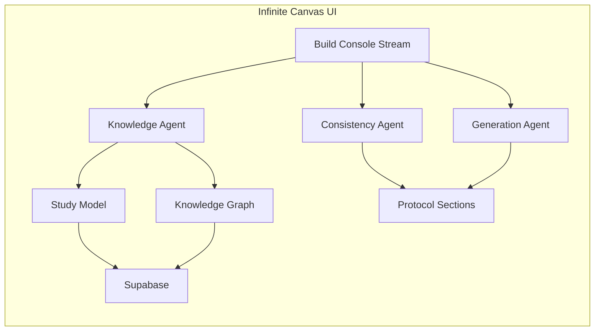

# Agent Architecture — M11 Studio Protocol Intelligence

Living architecture document for the lightweight protocol intelligence agent system in M11 Studio.

**Audience:** developers, architects, product owners, AI engineers, and future maintainers.

**Related docs:** `KNOWLEDGE_GRAPH_ARCHITECTURE.md`, `SUPABASE_ARCHITECTURE.md`

**Code locations:** `src/app/agents/`, `src/app/domain/study-model/`, `src/app/domain/knowledge-graph/`, `src/app/domain/protocol/import/`, `src/app/backend/`

---

## 1 — Overview

M11 Studio transforms uploaded clinical protocol documents into structured, ICH M11–aligned protocol sections. The protocol intelligence layer is built from **small, deterministic agents** orchestrated by runners and an `AgentManager`. Agents operate on **structured facts and relationships**, not only raw text.

### High-level data flow



### Three representations

| Representation | What it is | Primary use |
|----------------|------------|-------------|
| **Study Model** | Structured study facts in collections (objectives, endpoints, population, arms, …) | Authoring UI, agent inputs, section-scoped views |
| **Knowledge Graph** | Typed entities + directed relationships between study facts | Agent queries without rereading protocol text |
| **Protocol Sections** | Narrative M11 section content and workflow state | Document authoring, validation, generation |

**Study Model** answers: *What facts exist, and which sections contributed them?*

**Knowledge Graph** answers: *What depends on rPFS? What measures this objective?* without reparsing section bodies.

**Protocol Sections** answer: *What does the protocol say in M11 narrative form?*

### Agent design principles

1. **Lightweight** — no external agent framework; each agent is a pure `execute()` function plus a runner.
2. **Deterministic v1** — rules and heuristics first; LLM layers are future enhancements.
3. **Non-destructive patches** — agents merge into Study Model and Knowledge Graph; they do not wipe unrelated data.
4. **Observable** — every agent emits build-console events via `AgentManager`.
5. **Fail-safe** — agent failures must not crash import, edit, or generation workflows.

### Runtime orchestration

```
AgentRunner (per agent)
    ↓
AgentManager.runAgent(agentId, AgentContext)
    ↓
Agent.execute(context) → AgentResult
    ↓
Apply patches to stores + forward events to Protocol Build Console
    ↓
Schedule downstream agents (e.g. Knowledge → Consistency)
```

---

## 2 — Agent Inventory

All agents register with `AgentManager` (`src/app/agents/AgentManager.ts`). Shared context type: `AgentContext` (`src/app/agents/AgentContext.ts`).

| Agent ID | Label |
|----------|-------|
| `structural-mapping-agent` | Structural Mapping Agent |
| `knowledge-agent-v1` | Knowledge Agent |
| `consistency-agent` | Consistency Agent |
| `validation-agent` | Validation Agent |
| `generation-agent` | Generation Agent |

---

### Structural Mapping Agent

**Purpose:** Map source protocol content into ICH M11 section drafts during import.

| | |
|---|---|
| **Inputs** | Source document structure, extracted paragraphs, M11 template section map, source section candidates |
| **Outputs** | `importedUnvalidated` section drafts, suspicious mapping flags, unmapped source sections, mapping metadata |
| **Triggers** | Protocol import, structural remap |
| **Events** | Mapping started, sections mapped, suspicious/unmapped counts, mapping complete |
| **Updates** | `protocolImportStore` section drafts, build console section states |
| **Dependencies** | M11 template, source section detection, structural mapping rules |

**Current limitations:**

- Synonym and rule-based mapping only
- No LLM mapping fallback for ambiguous source structures
- Does not validate or generate narrative content

---

### Knowledge Agent

**Purpose:** Extract study facts from section text and incrementally update the Study Model and Knowledge Graph.

| | |
|---|---|
| **Inputs** | Section text (`imported`, `generated`, `edited`, `validated`, `reviewed`), section id/title, optional previous text for change detection |
| **Outputs** | `StudyModelPatch`, `knowledgeEntities[]`, `knowledgeRelationships[]`, `changedItems[]`, `affectedSectionIds[]`, notes |
| **Triggers** | Import, section edit (debounced), validation accept, section review/approval, regeneration |
| **Events** | Knowledge Agent started/completed, objective/population extraction, Knowledge Graph update started/updated |
| **Updates** | `studyModelStore`, `knowledgeGraphStore` (local + localStorage), may schedule Consistency Agent |
| **Dependencies** | Section heuristics (`knowledgeAgentHeuristics.ts`), graph extraction (`knowledgeGraphExtraction.ts`) |

**Current limitations:**

- Heuristic / regex extraction only — no dedicated LLM extraction layer yet
- Conservative relationship inference during section-level extraction
- Does not rewrite section narrative text

---

### Consistency Agent

**Purpose:** Detect downstream impacts when study facts change and mark affected protocol sections **out of sync**.

| | |
|---|---|
| **Inputs** | `changedItems` from Knowledge Agent, source section id, current Study Model, available section ids, optional Knowledge Graph section hints |
| **Outputs** | `affectedSectionIds`, `outOfSyncSectionIds`, per-section impact reasons, suggested actions (`validate`, `regenerate`, `edit`) |
| **Triggers** | Section edit, validation accept, review, regeneration (import/regeneration batched with debounce) |
| **Events** | Consistency Agent started, evaluating downstream impact, N sections marked out of sync, graph vs rules mode note |
| **Updates** | Section draft `workflowState: outOfSync`, `consistencyImpacts`, generation state in build console |
| **Dependencies** | M11 dependency rules (`consistencyRules.ts`), Knowledge Graph query helpers (optional v1 augmentation) |

**Current limitations:**

- Primary logic is deterministic M11 dependency rules — not a full semantic reasoning engine
- Knowledge Graph integration is **optional v1** — augments section impacts when graph relationships exist; falls back to rules alone
- Does not auto-regenerate or auto-validate downstream sections

---

### Validation Agent

**Purpose:** Validate imported or generated section content against M11 requirements and controlled terminology.

| | |
|---|---|
| **Inputs** | Section text, M11 template context, terminology rules, section workflow state |
| **Outputs** | Validation proposal, track-change segments, findings, terminology replacements |
| **Triggers** | Manual validate, validation workflow from import review |
| **Events** | Validation started, terminology checks, proposal ready, validation complete/failed |
| **Updates** | Section draft validation state (`validationProposed`, `validated`, etc.), validation findings on draft |
| **Dependencies** | `validationRules.ts`, ICH M11 controlled terminology, section validation engine |

**Current limitations:**

- Deterministic validation — not LLM-based compliance review
- Limited terminology harmonization scope
- Does not modify Study Model directly (Knowledge Agent runs after accept)

---

### Generation Agent

**Purpose:** Decide **what** to generate, **in what order**, and **what to skip** during import and manual generation flows.

| | |
|---|---|
| **Inputs** | Study Model, section drafts and workflow states, mapping results, generation context, trigger type |
| **Outputs** | Prioritized generation queue, skip decisions with reasons, generation summary counts |
| **Triggers** | Import, generate section, generate remaining, retry failed, manual/background queue |
| **Events** | Queue built, priority sections, skipped sections, generation scheduling summary |
| **Updates** | Generation queue consumed by import processor / build console; does not write section text itself |
| **Dependencies** | `generationSchedulingRules.ts`, build console section states, Study Model phase |

**Current limitations:**

- Deterministic scheduling — no adaptive learning from past runs
- Does not perform LLM generation (delegates to generation provider after queueing)
- High-complexity sections may wait for manual/priority trigger when context is thin

---

## 3 — Shared Data Models

### Core Study Model

**Location:** `src/app/domain/protocol/import/coreStudyModel.ts`

Fast, flat model built immediately after DOCX extraction. Powers first-pass generation context before deep enrichment completes.

**Owner:** Import pipeline (`protocolImportProcessor.ts`)

**Lifecycle:** Built during import → converted to `ProtocolKnowledgeModel` → merged into Study Model

---

### Study Model

**Location:** `src/app/domain/study-model/`

Structured collections: objectives, endpoints, estimands, population, arms, interventions, visits, activities, assessments, procedures, safety monitoring, statistical methods, eligibility, etc.

**Owner:** `studyModelStore.ts` (in-memory, subscribed by UI)

**Written by:** Study Model builder (import), Knowledge Agent patches

**Read by:** Study Model drawer, Consistency Agent, Generation Agent, Knowledge Graph builder

---

### Knowledge Graph (v1 — implemented)

**Location:** `src/app/domain/knowledge-graph/`

Entity–relationship graph: objectives, endpoints, populations, arms, document sections, etc., linked by `measured_by`, `supports`, `described_in`, and related types.

**Owner:** `knowledgeGraphStore.ts` (in-memory + `localStorage` key `m11-knowledge-graph-v1`)

**Written by:** Knowledge Agent patches, `buildKnowledgeGraphFromStudyModel()` on Study Model rebuild/merge

**Read by:** Query helpers, Consistency Agent (optional), Study Model drawer summary card

See `KNOWLEDGE_GRAPH_ARCHITECTURE.md` for entity types, relationship types, and patch semantics.

---

### Protocol Sections

**Location:** `protocolImportStore` drafts + `protocolStore` document

Narrative content, workflow state, validation state, generation status, consistency impacts.

**Owner:** `protocolImportStore.ts` (localStorage + IndexedDB for large bodies)

**States include:** `importedUnvalidated`, `needsGeneration`, `validationProposed`, `validated`, `outOfSync`, `reviewed`, …

---

### Validation History

**Location:** Per-section draft fields (`validationFindings`, `validationMessages`, `stateHistory`)

**Future:** `validation_runs` table in Supabase

---

### Agent Events

**Location:** `protocolBuildConsoleStore.ts` (in-memory, capped at 1500 events)

**Future:** `agent_events` table in Supabase for audit and replay

Each agent creates `AgentEvent` objects; `AgentManager` forwards them to the build console.

---

### Version History

**Location:** Draft `draftVersion`, protocol version metadata (future)

**Future:** `protocol_versions` commits linked to `protocols.current_version_id`

---

### Authoritative sections (M11 convention)

Facts extracted by Knowledge Agent are associated with source sections. Typical authoritative homes:

| Fact domain | Authoritative section(s) |
|-------------|--------------------------|
| Objectives | 3.1 (and synopsis 1.1) |
| Endpoints | 3.1 |
| Estimands | 3.x |
| Population / eligibility | 5.x |
| Arms / randomization / blinding | 4.x |
| Interventions | 6.x |
| Assessments / procedures / visits | 8.x |
| Safety monitoring | 9.x |
| Statistical methods | 10.x |

Consistency Agent dependency rules expand section prefixes (e.g. `3` → `3.1`, `3.2`) against available drafts.

---

## 4 — Agent Execution Order

Actual sequencing varies by trigger. Below is the **intended** order for major workflows.

### Import flow



```
DOCX upload
  ↓
Structural Mapping Agent          → section drafts (importedUnvalidated)
  ↓
Core Study Model + Study Model    → structured facts for generation context
  ↓
Knowledge Graph merge             → entities/relationships from Study Model
  ↓
Generation Agent                  → queue + skip decisions
  ↓
Section generation (provider)     → generated section text
  ↓
Knowledge Agent (per section)     → Study Model + Knowledge Graph patches
  ↓
Validation Agent (on demand)      → validation proposal
  ↓
Consistency Agent (on changes)    → out-of-sync downstream sections
```

Import/regeneration consistency checks are **batched** (800ms debounce) to avoid event spam.

---

### Editing flow

```
User edits section text
  ↓
Knowledge Agent (500ms debounce)
  ↓
Consistency Agent (if changedItems non-empty)
```

---

### Validation accept flow

```
User accepts validation proposal
  ↓
Validation Agent result applied   → workflowState validated
  ↓
Knowledge Agent                   → refresh Study Model + Knowledge Graph from validated text
  ↓
Consistency Agent                 → propagate impacts to downstream sections
```

---

### Generation flow

```
User triggers generate (section / remaining / retry)
  ↓
Generation Agent                  → build queue
  ↓
Section generation (LLM/provider)
  ↓
Knowledge Agent                   → extract facts from new text
  ↓
Consistency Agent                 → mark downstream out of sync if facts changed
```

---

## 5 — Knowledge Graph Roadmap

### Current state (v1)

Knowledge Graph v1 is **implemented** in the domain layer:

- Local in-memory + `localStorage` persistence
- Built from Study Model via `buildKnowledgeGraphFromStudyModel()`
- Patched by Knowledge Agent section extraction
- Query helpers for agents (`getEntitiesMeasuredBy`, `getDownstreamSectionIdsFromGraph`, …)
- Supabase schema scaffold (`002_knowledge_graph.sql`) and repositories — **not yet wired as runtime source of truth**
- Consistency Agent optionally augments impacts using graph-linked sections

**Important:** The Knowledge Graph is **not a visual graph UI**. It is a **queryable relationship model** for agents and future tooling.

### Entity types (current)

Study, Objective, Endpoint, Estimand, Population, Arm, Intervention, Visit, Activity, Assessment, Procedure, Safety Variable, Statistical Method, Eligibility Criterion, Terminology Term, Document Section, Source Document, Other

### Relationship types (current)

`measured_by`, `depends_on`, `supports`, `belongs_to`, `requires`, `evaluated_in`, `derived_from`, `described_in`, `scheduled_at`, `uses`, `has_objective`, `has_endpoint`, `has_intervention`, `has_assessment`, `has_population`, `has_statistical_method`, `related_to`

Example:

```
Objective "Radiographic Progression Free Survival"
  --measured_by-->
Endpoint "rPFS"
```

An agent can query *“What objectives measure rPFS?”* via `getEntitiesMeasuredBy('endpoint_rpfs')` without rereading the uploaded protocol.

### Planned enhancements

| Phase | Goal |
|-------|------|
| **v1.1** | Richer relationship inference from co-occurring Study Model facts |
| **v2** | Supabase dual-write; graph as durable query surface across sessions |
| **v3** | Graph-driven Validation and Generation targets |
| **v4** | Cross-protocol entity linking (terminology, endpoint libraries) |
| **v5** | Visual dependency explorer (separate from v1 data model) |

---

## 6 — Supabase Integration

### Current persistence

| Concern | Storage |
|---------|---------|
| Import drafts & workflow | Browser `localStorage` / IndexedDB |
| Study Model | In-memory React store |
| Knowledge Graph | In-memory + `localStorage` |
| Build console events | In-memory (1500 event cap) |
| Agent results | Not durably persisted |

Default provider: `BrowserStorageProvider` — no Supabase credentials required.

### Planned persistence

```
Frontend agents + stores
       ↓
Repository Layer (src/app/backend/repositories/)
       ↓
StorageProvider (Supabase opt-in)
       ↓
Postgres
```

### Tables (schema scaffold)

| Table | Purpose |
|-------|---------|
| `protocols` | Top-level protocol record |
| `protocol_sections` | Section content and workflow state |
| `core_study_models` | Versioned core model JSONB |
| `knowledge_layers` | Versioned knowledge layer JSONB snapshots |
| `knowledge_entities` | Graph entities |
| `knowledge_relationships` | Graph edges |
| `agent_events` | Agent audit / build-console events |
| `validation_runs` | Validation results |
| `protocol_versions` | Commit-style version history |
| `source_documents` | Imported DOCX metadata |

Migrations are **manual only** — see `SUPABASE_ARCHITECTURE.md`.

### Migration phases (planned)

1. **Foundation** — schema, repositories, providers (done)
2. **Dual-write** — shadow persistence while UI reads browser stores
3. **Read switch** — repositories become source of truth per entity
4. **Auth + RLS** — multi-tenant production
5. **Browser deprecation** — remove legacy keys after parity validation

---

## 7 — Future Agents

Potential agents not yet implemented. Listed for roadmap planning.

| Agent | Purpose |
|-------|---------|
| **Terminology Agent** | Harmonize controlled terminology across sections and Study Model |
| **Protocol Compliance Agent** | Deep M11 / regulatory completeness checks beyond Validation Agent v1 |
| **Dependency Graph Agent** | Visual and queryable cross-section dependency analysis (UI + graph) |
| **Risk Detection Agent** | Flag scientific / operational risks from study design facts |
| **SoA Agent** | Schedule of Activities coherence vs assessments, visits, arms |
| **Statistics Agent** | Sample size, estimand, and method consistency vs endpoints |
| **Endpoint Consistency Agent** | Cross-check endpoints across synopsis, objectives, stats, SAP hints |
| **Regulatory Readiness Agent** | Pre-submission completeness scoring |
| **Cross-Protocol Reuse Agent** | Match and reuse facts across sponsor protocol portfolio |

Future agents should follow the same pattern: typed input/output, runner, `AgentManager` registration, build-console events, non-destructive store patches.

---

## 8 — Agent Operations Graph (Future Concept)

**Status:** Concept only — no implementation.

A future **Agent Operations Graph** would provide observability over the protocol intelligence pipeline:



**Planned capabilities:**

- Live agent node status (idle, running, failed)
- Data node snapshots (entity counts, section states)
- Knowledge Graph node with query preview
- Supabase persistence node (sync status)
- Event stream mirrored from build console

**Purpose:** debugging, observability, agent transparency for power users and engineers — not required for core authoring workflows.

---

## Assumptions documented

1. **ICH M11 section numbering** is the primary organizing principle for dependency rules and authoritative sections.
2. **Agents are synchronous/async functions**, not long-running external services — orchestration lives in the browser today.
3. **Study Model is the authoring-facing fact layer**; Knowledge Graph is the relationship/query layer; neither replaces Protocol Section narrative text.
4. **Out-of-sync is advisory** — users choose whether to validate, regenerate, or edit downstream sections.
5. **No auth / multi-tenancy** in current agent runtime — Supabase scaffold is single-protocol oriented until a later phase.
6. **LLM usage** is confined to section generation providers today — agents themselves are deterministic in v1.

---

## Document maintenance

Update this file when:

- A new agent is added or an agent ID changes
- Execution order or triggers change in runners/import processor
- Knowledge Graph or Supabase wiring moves from scaffold to production
- A planned future agent moves to implemented status

Last aligned with codebase agents: Structural Mapping, Knowledge, Consistency, Validation, Generation (all v1).
